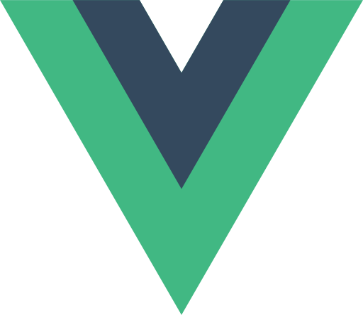
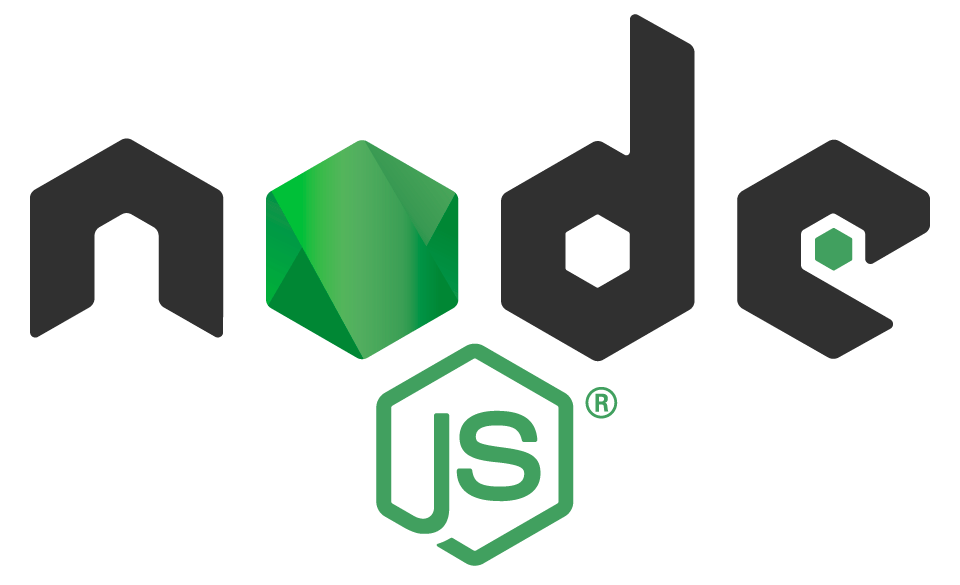

# Exam Management System

   
   
   
   

A student assessment management system to be used by faculty members, students, and other members of an educational insitution requiring access to student grades. 

This project was initiated in compliance with the needs of the **Ateneo de Davao University - Computer Studies** organization.

## Table of Contents
* [Frameworks Used](#frameworks-used)
    * [MongoDB](#mongodb)
    * [Express](#express)
    * [Vue.js](#vuejs)
    * [Node.js](#nodejs)
* [About the System](#about-the-system)
    * [Functionalities](#functionalities)
    * [Possible Sub-Systems](#possible-sub-systems)

## Frameworks Used
This project utilizes the [MEVN](https://www.educative.io/answers/what-is-mevn-stack) stack. Listed below are the technologies used in this stack.
### [MongoDB](https://www.mongodb.com/)

> MongoDB is a document database with the scalability and flexibility that you want with the querying and indexing that you need.[^1]
### [Express](https://expressjs.com/)

> Express is a minimal and flexible Node.js web application framework that provides a robust set of features for web and mobile applications.[^2]
### [Vue.js](https://vuejs.org/)

> Vue (pronounced /vjuː/, like view) is a JavaScript framework for building user interfaces. It builds on top of standard HTML, CSS, and JavaScript and provides a declarative and component-based programming model that helps you efficiently develop user interfaces, be they simple or complex.[^3]
### [Node.js](https://nodejs.org/en/)

> As an asynchronous event-driven JavaScript runtime, Node.js is designed to build scalable network applications. In the following "hello world" example, many connections can be handled concurrently. Upon each connection, the callback is fired, but if there is no work to be done, Node.js will sleep.[^4]

## About the System
Hello World

### Functionalities
The main system is designed to accomplish these basic tasks:
* Record grades
* View grades
* Create report cards
* Distribute report cards

### Possible Sub-Systems
* Student Profiling System
* Teacher Profiling System
* Curriculum Management System
* Grade Appeal System

[^1]: [What Is MongoDB?](https://www.mongodb.com/what-is-mongodb)
[^2]: [Express](https://expressjs.com/)
[^3]: [What is Vue?](https://vuejs.org/guide/introduction.html)
[^4]: [About Node.js](https://nodejs.org/en/about/)
